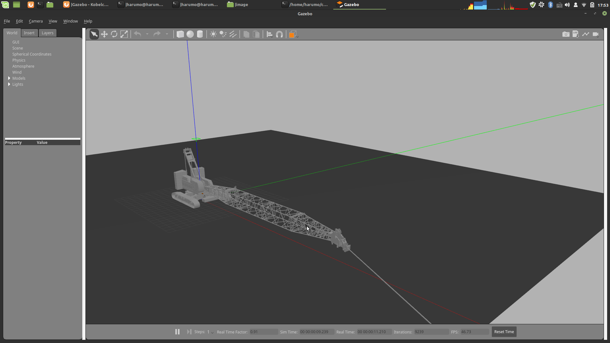
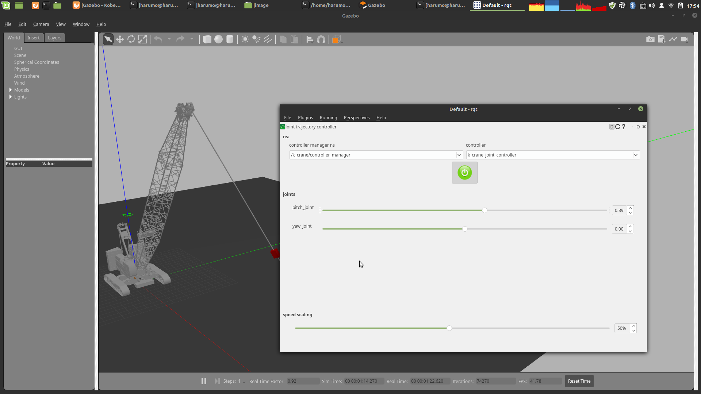

# Gazebo

物理シミュレーションであるgazeboの使用方法について説明します．
このシミュレータ中のクレーンには慣性センサとカメラが設置されています．これらはプログラム中から使用することができます．
`k_crane_controle`と本パッケージを組み合わせて使用することでクレーンを制御することができます．
クレーンはプログラムの中から時々刻々制御することも，事前に軌道を生成しておいて，それを実行することもできます．

!!! Note
	現在，このシミュレータは開始時に任意の姿勢を取ることができない問題があります．
	単純に開発者がやり方がわかっていないだけなのですが．．．でも代替案を用意してあるので
	安心してください．

## チュートリアル

### シミュレータの立ち上げ方

1. 何もセンサを設置していない素のシミュレータ
```
roslaunch k_crane_gazebo k_crane_gazebo.launch 
```

2. カメラや吊り荷，センサを搭載したシミュレータ
```
roslaunch k_crane_gazebo k_crane_with_payload.launch 
```

カメラなどのセンサを追加する場合は`k_crane_description/robots/k_crane_with_payload.urdf.xacro`
を参考にしてください．




### 初期状態への以降
```
rosrun k_crane_control intial_state
```
クレーンを指定した初期状態（旋回角，起伏角）に移動させるプログラム．
２つの角度はプログラム内に直書きしてしまっているので，変更するたびにコンパイルが必要です．

### 揺れの停止
ロープの揺れを強制的に止めるプログラム群

- joint12 (may nonsense)
```
rosrun k_crane_control initial_joint12
```

- joint23 (may nonsense)
```
rosrun k_crane_control initial_joint23
```

- joint 4 (may nonsense)
```
rosrun k_crane_control initial_joint4
```

### 手動でクレーンを動かす



gazeboを立ち上げた状態で，コントロールボードを立ち上げるためにrqtを起動します．

```
rqt
```

プラグインを設定します．

Plugins -> Robot Tools -> joint trajectory controller

controller manager nsを`/k_crane/controller_manager`, controllerを`k_crane_controller`に設定します．

設定後，中央の電源ボタンアイコンを押し，緑になったら，スライドバーを左右に移動させるとクレーンも移動します．

### カメラ画像を取得する


**手動でクレーンを動かす**を行った後に，rqtのPluginsからVisulalization-> Image Viewを選択し`/front_camera/image_raw`トピックを選択することにより，クレーンに設置されたカメラからの画像を取得することができる．このカメラの設定はxacroファイルを変更することで行なえる．

### 実験的に揺れを起こす

- 初期状態に移動する
```
rosrun k_crane_control intial_state
```

- ロープを６度だけ傾ける
```
rosrun k_crane_control initial_joint_boom_pi 
```

- 佐野先生の制振軌道を送る（軌道は適当らしく，うまく行かない）
```
 rosrun k_crane_control sano_joint_trajectory_action
```

- gazebo下部の再生ボタンを押すと，シミュレータが開始され，制振軌道が送られる


### ツール

- gazeboをプログラム内から一時停止する
```
rosrun k_crane_control pause_gazebo
```

- 停止中のgazeboをプログラム内から再開させる
```
rosrun k_crane_control pause_gazebo
```

- 速度軌道を位置軌道へ変換する
	```
	rosrun k_crane_control integral
	```
	速度コマンドを位置コマンドへ積分するプログラム
	積分するcsvファイルの指定はプログラム内で行っています．
	初期位置もプログラム内で指定する必要あり．
	サンプリング周期はプログラム内で指定しており，現在は１００Hzです．


## Tips
- base.urdf.xacro

	**inertia**タグの中の要素に負の値を含めることはできない．全て正の値である必要がある．
	そうしないと，ロボットが地面と衝突せず，沈んでいく．また，クレーンは質量が大きく
	通常の場合は慣性テンソルの対角成分以外は０になるが，０にすると挙動がおかしくなる．
	そのため100に設定した．
