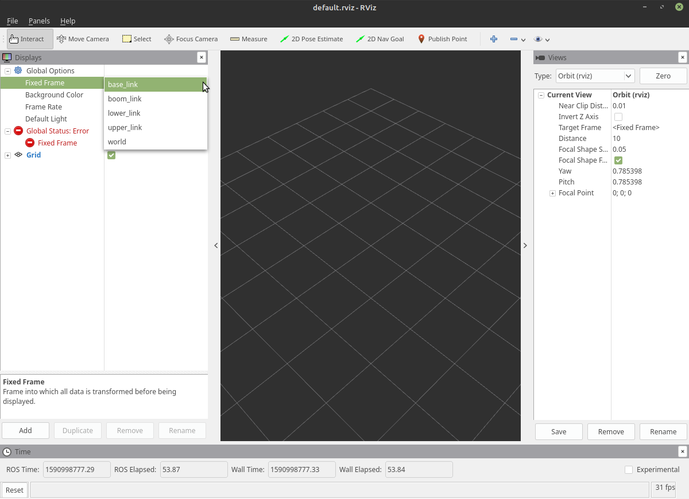
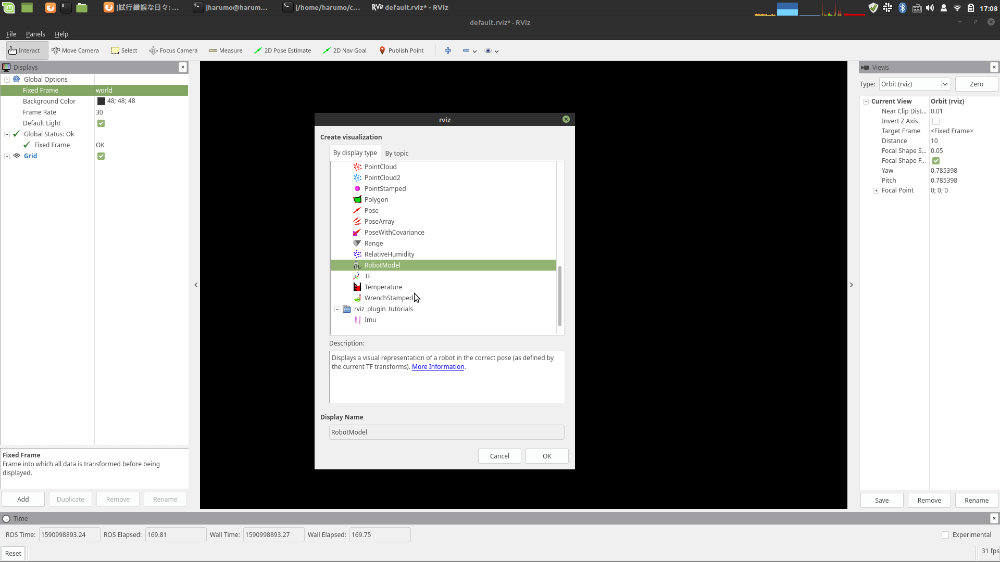
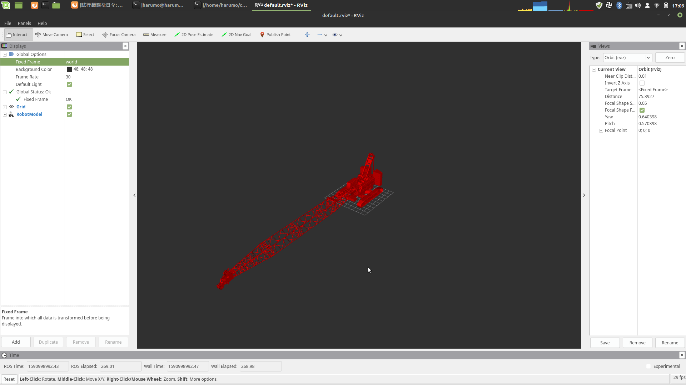

# Description

このパッケージはクレーンの基本的な情報について説明しています．
この中に含まれるファイルをいじることで，クレーンの外観を変更したり，関節に設置されているモータの
強さなどを変更することができます．

## ファイル説明
```
├── CMakeLists.txt
├── config
│   └── joint_names.yaml :関節の名前を設定するファイル
├── launch
│   ├── base.launch : テスト用．クレーンの土台をrvizで出力
│   ├── k_crane_description.launch : クレーンの基本情報をROSパラーメタサーバに上げる
│   ├── k_crane_display.launch : rvizで表示
│   ├── k_crane_with_payload_description.launch : クレーンの基本情報をROSパラメータサーバに上げる．吊り荷あり
│   └── k_crane_with_payload_display.launch : rvizで表示．吊り荷あり
├── meshes : 各種メッシュデータ
│   ├── base.stl 
│   ├── boom.stl
│   ├── document
│   ├── engine.stl
│   ├── lower.stl
│   ├── payload.stl
│   ├── rope.stl
│   ├── specifications.pdf : 機密情報．クレーンのスペック
│   ├── upper.stl
│   └── ブームフットピン座標.pdf : 機密情報．関節の座標を確かめるのに使用
├── package.xml
└── robots : 設定ファイル
    ├── base.urdf.xacro : テスト用．クレーンの土台の設定ファイル
    ├── camera.urdf.xacro : gazeboでカメラを使用するための設定ファイル
    ├── common.urdf.xacro : マクロ定義用のファイル
    ├── fixed_payload.urdf.xacro : 吊り荷の設定ファイル
    ├── imu_100.urdf.xacro : 慣性センサ用の設定ファイル(100Hz)
    ├── imu_128.urdf.xacro : 慣性センサ用の設定ファイル(128Hz)
    ├── imu.urdf.xacro : 慣性センサの基本的な設定ファイル
    ├── k_crane.urdf.xacro : 吊り荷なしクレーンの設定ファイル．要素部品のファイルをインクルードしている
    ├── k_crane_with_fixed_payload.urdf.xacro : テスト用
    ├── k_crane_with_payload.urdf.xacro : 吊り荷ありクレーンの設定ファイル．要素部品のファイルをインクルードしている
    ├── misc.xacro : その他の設定
    └── payload.urdf.xacro : ロープを含めた吊り荷の設定ファイル


```


## チュートリアル
### rvizでクレーンを表示
#### 1. 釣りになし

rvizを立ち上げて，クレーンを表示してみましょう．
```
roslaunch k_crane_description k_crane_display.launch 
```



空のrvizが立ち上がったと思います．
ここで，まず，画面左上のFixed Frameを`map`から`world`に変更しましょう．
これで，エラーが消えます．

次に，モデルを読み込みましょう．
画面左下の`Add`を押して，`RobotModel`を選択しましょう．



これによって，真っ赤なクレーンが表示されたと思います．



rvizと同時に現れたスライドバーを操作することで，クレーンを動かすことができます．
可動域などを確かめてみましょう．
ここで，可動域に不満がある場合は設定ファイル(k_crane_description/robots/k_crane.urdf)をいじることで
変更することが可能です．

#### 2. 吊り荷あり
今度は上記の，吊り荷ありバージョンを試してみましょう．
```
roslaunch k_crane_description k_crane_with_payload_display.launch 
```
吊り荷なしバージョンと同様に，
まず，画面左上のFixed Frameを`map`から`world`に変更しましょう．
次に，モデルを読み込みましょう．
画面左下の`Add`を押して，`RobotModel`を選択しましょう．
これによって，真っ赤なクレーンが表示されたと思います．

